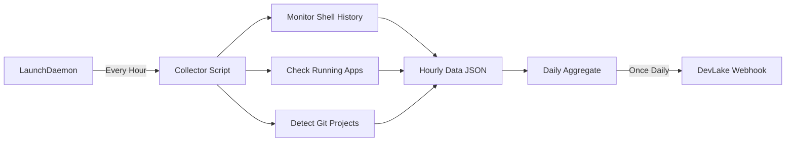

# DevLake Telemetry Collector for macOS

A privacy-safe, transparent telemetry collection system that monitors developer productivity metrics and sends them to a DevLake webhook. Designed to be deployed via Mosyle Custom Commands.

## 🎯 Overview

This system collects aggregated developer metrics without capturing sensitive information. It runs silently in the background as a macOS LaunchDaemon, collecting data every hour and sending a daily summary to your DevLake instance.

### What It Collects

✅ **Privacy-Safe Metrics:**
- Command usage counts (e.g., `git`, `docker`, `npm`, `go`)
- Active developer tools (VSCode, IntelliJ, PyCharm, etc.)
- Active development hours
- Project names (from git repositories)
- Aggregated build metrics

❌ **What It Does NOT Collect:**
- Command arguments or parameters
- File paths or contents
- URLs or browsing history
- Personal or confidential data
- Actual code or snippets

## 🏗️ Architecture



### How It Works

1. **Hourly Collection**: LaunchDaemon triggers the collector script every hour
2. **Data Monitoring**: Script checks shell history, running processes, and git repositories
3. **Privacy Filtering**: Removes all sensitive information, keeping only command names and counts
4. **Local Aggregation**: Merges hourly data into a daily summary
5. **Daily Transmission**: Sends one JSON payload per day to DevLake webhook

## 📦 Components

- [`devlake-telemetry-collector.sh`](file:///Users/irfan.ahmad/mosyle-dev-telemetry/devlake-telemetry-collector.sh) - Main collection script
- [`com.devlake.telemetry.plist`](file:///Users/irfan.ahmad/mosyle-dev-telemetry/com.devlake.telemetry.plist) - LaunchDaemon configuration
- [`config.json`](file:///Users/irfan.ahmad/mosyle-dev-telemetry/config.json) - Configuration file
- [`install-telemetry.sh`](file:///Users/irfan.ahmad/mosyle-dev-telemetry/install-telemetry.sh) - Installation script
- [`uninstall-telemetry.sh`](file:///Users/irfan.ahmad/mosyle-dev-telemetry/uninstall-telemetry.sh) - Uninstallation script

## 🚀 Installation

### Manual Installation

```bash
# Clone or download the repository
cd mosyle-dev-telemetry

# Run the installation script
sudo ./install-telemetry.sh
```

### Mosyle Deployment

1. **Upload Files to Mosyle:**
   - Go to Mosyle Dashboard → Devices → Custom Commands
   - Upload all files from this directory

2. **Create Custom Command:**
   - Command Type: Script
   - Script Content: Contents of `install-telemetry.sh`
   - Target: Your developer devices

3. **Deploy:**
   - Execute the command on target devices
   - The daemon will start automatically

## ⚙️ Configuration

Edit `/usr/local/etc/devlake-telemetry/config.json`:

```json
{
  "webhook_url": "https://your-devlake-instance.com/api/webhooks/your-id",
  "collection_interval_seconds": 3600,
  "data_retention_days": 30
}
```

### Setting Your Webhook URL

**Option 1: Edit config file directly**
```bash
sudo nano /usr/local/etc/devlake-telemetry/config.json
```

**Option 2: Use environment variable**
```bash
export DEVLAKE_WEBHOOK_URL="https://your-webhook-url"
```

**Option 3: Via Mosyle**
- Add webhook URL to Mosyle environment variables for the script

## 📊 Sample Payload

The daily payload sent to DevLake:

```json
{
  "date": "2026-02-09",
  "developer": "irfan.ahmad",
  "metrics": {
    "active_hours": 9,
    "tools_used": ["vscode", "docker", "go"],
    "commands": {
      "git": 45,
      "docker": 12,
      "go": 23,
      "npm": 8
    },
    "projects": [
      "mosyle-dev-telemetry",
      "incubator-devlake"
    ]
  }
}
```

## 🔍 Monitoring

### Check Daemon Status

```bash
# List running daemons
sudo launchctl list | grep devlake

# View recent logs
tail -f /var/log/devlake-telemetry.log

# View error logs
tail -f /var/log/devlake-telemetry-error.log
```

### View Collected Data

```bash
# Current daily aggregate
cat /var/tmp/devlake-telemetry/daily_aggregate.json | jq .

# Last hourly collection
cat /var/tmp/devlake-telemetry/hourly_data.json | jq .

# Archived data
ls -lh /var/tmp/devlake-telemetry/archive/
```

### Manual Trigger

```bash
# Run collector manually (for testing)
sudo /usr/local/bin/devlake-telemetry-collector.sh
```

## 🛠️ Troubleshooting

### Daemon Not Running

```bash
# Reload the daemon
sudo launchctl unload /Library/LaunchDaemons/com.devlake.telemetry.plist
sudo launchctl load /Library/LaunchDaemons/com.devlake.telemetry.plist
```

### No Data Being Collected

1. Check if `jq` is installed:
   ```bash
   which jq || brew install jq
   ```

2. Verify shell history files exist:
   ```bash
   ls -lh ~/.zsh_history ~/.bash_history
   ```

3. Check permissions:
   ```bash
   ls -ld /var/tmp/devlake-telemetry
   ```

### Webhook Errors

1. Test webhook manually:
   ```bash
   curl -X POST https://your-webhook-url \
     -H "Content-Type: application/json" \
     -d '{"test": "data"}'
   ```

2. Check error logs:
   ```bash
   tail -n 50 /var/log/devlake-telemetry-error.log
   ```

## 🗑️ Uninstallation

```bash
sudo ./uninstall-telemetry.sh
```

This will:
- Stop and remove the LaunchDaemon
- Remove the collector script
- Remove configuration files
- Optionally remove collected data

## 🔒 Security & Privacy

### Data Privacy
- **No sensitive data**: Only command names and counts are collected
- **No file access**: Never reads file contents or captures paths
- **No network monitoring**: Browser activity is completely ignored
- **Local aggregation**: Data stays on device until daily send

### Security Features
- Runs with minimal privileges (standard user, not root)
- Low process priority (nice value 10)
- Logging for audit trail
- Configurable privacy filters

### Mosyle Integration
- Uses existing Mosyle infrastructure
- Leverages Mosyle certificate management
- Only company-verified Macs can send data
- Integrates with Mosyle firewall settings

## 📋 Requirements

- macOS 10.14 or later
- `jq` (JSON processor) - Auto-installed via Homebrew if missing
- `curl` (included in macOS)
- Admin access for installation

## 🤝 Contributing

This is a privacy-first telemetry system. When contributing:
- Never add data collection that captures sensitive information
- Always filter out arguments, paths, and personal data
- Document what data is collected and why
- Test privacy compliance thoroughly

## 📝 License

Internal use only - Mosyle Developer Experience Telemetry

---

**Questions?** Contact your DevOps team or check the logs at `/var/log/devlake-telemetry.log`
